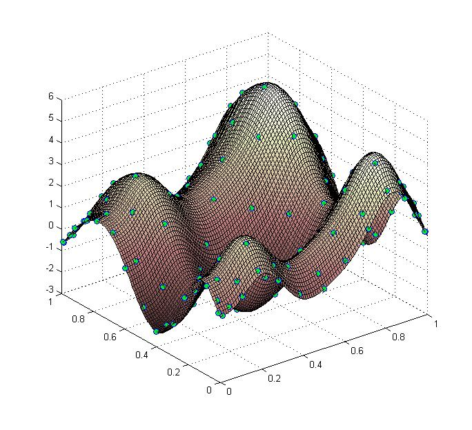
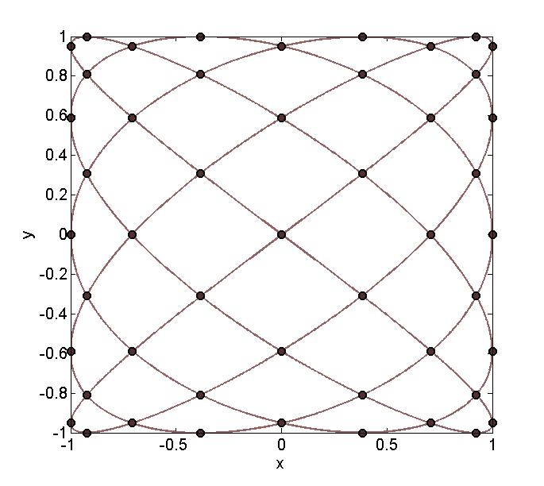

# LC2Ditp
Bivariate polynomial interpolation on the node points of Lissajous curves
--------------------------------------------------------------------------------

&nbsp;&nbsp;&nbsp;&nbsp;&nbsp;&nbsp;&nbsp;&nbsp;&nbsp; &nbsp;&nbsp; &nbsp;&nbsp;&nbsp;&nbsp;&nbsp;&nbsp;&nbsp;&nbsp;&nbsp; &nbsp;&nbsp; 

Version: 0.3 (01.10.2017)

Written by <a href="http://www.math.uni-luebeck.de/mitarbeiter/dencker/index.php"> Peter Dencker</a> and <a href="http://math.hawaii.edu/~erb/index.html"> Wolfgang Erb</a>

Description
-----------

The package LC2Ditp contains a Matlab implementation for bivariate polynomial interpolation on 
general Lissajous-Chebyshev points.
The description of the point sets LC and the polynomial interpolation scheme is provided in the article [1]. 

The main test file for interpolation is
main_example.m

For plotting 2D Lissajous curves and the LS points use
plot_LC2D.m

Citation and Credits
--------------------

The theory for this code was developed by

- Peter Dencker (Institute of Mathematics, University of Luebeck) 
- Wolfgang Erb (Department of Mathematics, University of Hawaii at Manoa) 

For non-degenerate Lissajous curves, the theory and the interpolation scheme were developed in:

*   [1] &nbsp; Erb, W., Kaethner, C., Ahlborg, M. and Buzug, T.M.  
    <i>Bivariate Lagrange interpolation at the node points of non-degenerate Lissajous curves </i>  
    Numer. Math. 133, 4 (2016), 685-705

    
For degenerate Lissajous curves, the respective results can be found in:

*   [2] &nbsp; Erb, W.  
    <i> Bivariate Lagrange interpolation at the node points of Lissajous curves - the degenerate case </i>  
    Appl. Math. Comput. 289 (2016), 409-425

The results of these two papers are summarized in:

*   [3] &nbsp; Erb, W., Kaethner, C., Dencker, P., and Ahlborg, M.  
    <i> A survey on bivariate Lagrange interpolation on Lissajous nodes </i>  
    Dolomites Research Notes on Approximation 8 (Special issue) (2015), 23-36

In the implementation, we follow the notation given in [3]. 

For an application of this code in Magnetic Particle Imaging, see 

*   [4] &nbsp; Kaethner, C., Erb, W., Ahlborg, M., Szwargulski, P., Knopp, T. and Buzug, T. M.  
    <i> Non-Equispaced System Matrix Acquisition for Magnetic Particle Imaging based on Lissajous Node Points </i>  
    IEEE Transactions on Medical Imaging (2016), in press, DOI: 10.1109/TMI.2016.2580458 
    
For an extension of the theory to the general multidimensional case see

*   [5] &nbsp; Dencker, P. and Erb, W.  
    <i> Multivariate polynomial interpolation on Lissajous-Chebyshev nodes </i>  
    arXiv:1511.04564v1 [math.NA] (2015) 

For the parameters n = (k,k+1), n = (k+1,k) the implemented
interpolation points are exactly the Padua points, see

*   [6] &nbsp; Bos, L., Caliari, M., De Marchi, S., Vianello, M. and Xu, Y.  
    <i> Bivariate Lagrange interpolation at the Padua points: the generating curve approach </i>  
    J. Approx. Theory 143 (2006), 15--25 

*   [7] &nbsp; Caliari, M., De Marchi, S. and Vianello, M.  
    <i> Algorithm 886: Padua2D: Lagrange Interpolation at Padua Points on Bivariate Domains </i>  
    ACM Trans. Math. Software 35-3 (2008) 

License
-------

Copyright (C) 2017 Peter Dencker, Wolfgang Erb

This software was written by Peter Dencker and Wolfgang Erb 
and developed at the University of Luebeck and the University of Hawaii

LC2Ditp is free software: you can redistribute it and/or modify
it under the terms of the GNU General Public License as published by
the Free Software Foundation, either version 3 of the License, or
(at your option) any later version.

This program is distributed in the hope that it will be useful,
but WITHOUT ANY WARRANTY; without even the implied warranty of
MERCHANTABILITY or FITNESS FOR A PARTICULAR PURPOSE.  See the
GNU General Public License for more details.

You should have received a copy of the GNU General Public License
along with this program. If not, see <http://www.gnu.org/licenses/>.
