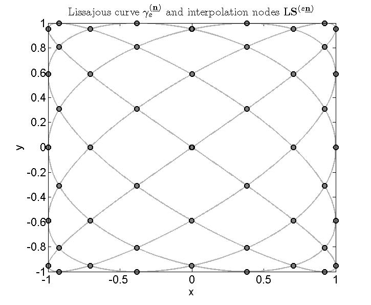

# LS2Ditp
Bivariate polynomial interpolation on the nodes of Lissajous curves
--------------------------------------------------------------------------------

 &nbsp;&nbsp;&nbsp;&nbsp;&nbsp;&nbsp;&nbsp;&nbsp;&nbsp; &nbsp;&nbsp; 

Version: 0.2 (01.05.2016)

Written by <a href="http://math.hawaii.edu/~erb/index.html"> Wolfgang Erb</a>

Description
-----------

The package LS2Ditp contains a Matlab-implementation for 2D polynomial interpolation on 
the node points LS of degenerate and non-degenerate 2D-Lissajous curves. See [3] for
the theoretical description of the Lissajous curves, the point sets LS and
the polynomial interpolation scheme. 

The main test file for interpolation is
main_example.m

For plotting 2D Lissajous curves and the LS points use
plot_Lissajous.m

Citation and Credits
--------------------

The following people contributed to the development and the theory of this code:

- Wolfgang Erb (Institute of Mathematics, University of Luebeck) in [1,2,3]
- Christian Kaethner (Institute of Medical Engineering, University of Luebeck) in [1,3]
- Mandy Ahlborg (Institute of Medical Engineering, University of Luebeck) in [1,3]
- Thorsten M. Buzug (Institute of Medical Engineering, University of Luebeck) in [1]
- Peter Dencker (Institute of Mathematics, University of Luebeck) in [3]

For non-degenerate Lissajous curves, the theory and the interpolation scheme were developed in:

1)  Erb, W., Kaethner, C., Ahlborg, M. and Buzug, T.M. 
    Bivariate Lagrange interpolation at the node points of non-degenerate Lissajous curves. 
    Numer. Math. 133, 4 (2016), 685-705
    
For degenerate Lissajous curves, the respective results can be found in:

[2] Erb, W. 
    Bivariate Lagrange interpolation at the node points of Lissajous curves - the degenerate case, 
    Appl. Math. Comput. 289 (2016) 409-425

The results of these two papers are summarized in:

[3] Erb, W., Kaethner, C., Dencker, P., and Ahlborg, M.
    A survey on bivariate Lagrange interpolation on Lissajous nodes,
    Dolomites Research Notes on Approximation 8 (Special issue) (2015), 23-36

In the implementation, we follow the notation given in [3]. 

For an application of this code in Magnetic Particle Imaging, see 

[4] Kaethner, C., Erb, W., Ahlborg, M., Szwargulski, P., Knopp, T. and Buzug, T. M. 
    Non-Equispaced System Matrix Acquisition for Magnetic Particle Imaging based on Lissajous Node Points 
    IEEE Transactions on Medical Imaging (2016), in press, DOI: 10.1109/TMI.2016.2580458 
    
For an extension of the theory to higher dimensions see

[5] Dencker, P. and Erb, W. 
    Multivariate polynomial interpolation on Lissajous-Chebyshev nodes 
    arXiv:1511.04564v1 [math.NA] (2015) 

For degenerate 2D-Lissajous curves and the parameters n = (k,k+1), n = (k+1,k) the implemented
interpolation points are exactly the Padua points, see

[6] Bos, L., Caliari, M., De Marchi, S., Vianello, M. and Xu, Y. 
    Bivariate Lagrange interpolation at the Padua points: the generating curve approach
    J. Approx. Theory 143 (2006), 15--25 

[7] Caliari, M., De Marchi, S. and Vianello, M.
    Algorithm 886: Padua2D: Lagrange Interpolation at Padua Points on Bivariate Domains 
    ACM Trans. Math. Software 35-3 (2008) 

License
-------

Copyright (C) 2016 Wolfgang Erb

This software was written by Wolfgang Erb 
and developed at the Institute of Mathematics, University of Luebeck.

LS2Ditp is free software: you can redistribute it and/or modify
it under the terms of the GNU General Public License as published by
the Free Software Foundation, either version 3 of the License, or
(at your option) any later version.

This program is distributed in the hope that it will be useful,
but WITHOUT ANY WARRANTY; without even the implied warranty of
MERCHANTABILITY or FITNESS FOR A PARTICULAR PURPOSE.  See the
GNU General Public License for more details.

You should have received a copy of the GNU General Public License
along with this program. If not, see <http://www.gnu.org/licenses/>.
