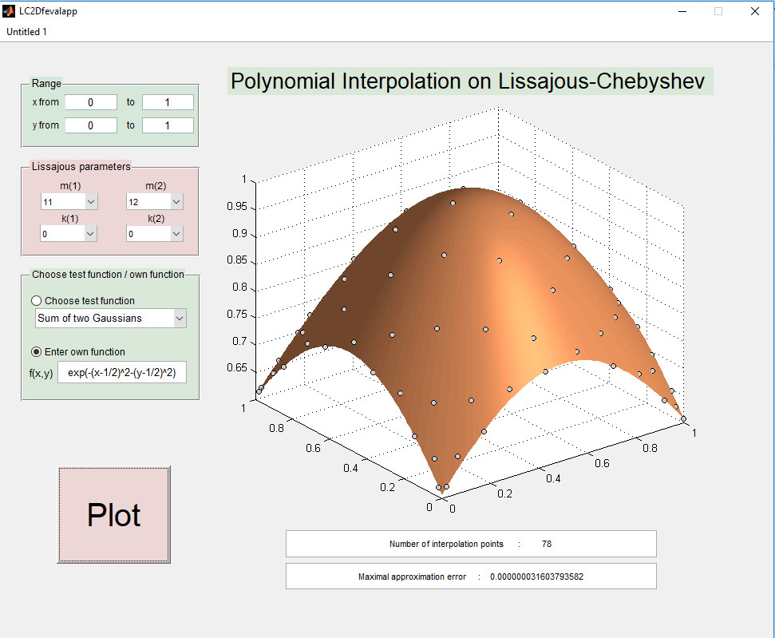

# LC2Ditp

Bivariate polynomial interpolation on Lissajous-Chebyshev points
--------------------------------------------------------------------------------

&nbsp;&nbsp;&nbsp;&nbsp;&nbsp;&nbsp;&nbsp;&nbsp;&nbsp; &nbsp;&nbsp; &nbsp;&nbsp;&nbsp;&nbsp;&nbsp;&nbsp;&nbsp;&nbsp;&nbsp; &nbsp;&nbsp; 

Version: 0.3 (01.10.2016)

Written by <a href="http://www.math.uni-luebeck.de/mitarbeiter/dencker/index.php"> Peter Dencker</a> and <a href="http://www.lissajous.it"> Wolfgang Erb</a>

Description
-----------

The package LC2Ditp contains a Matlab and a Python implementation for bivariate polynomial interpolation on 
general Lissajous-Chebyshev points. This package syntesizes various interpolation schemes known in the literature. 

  

&nbsp;&nbsp;&nbsp;&nbsp;&nbsp;&nbsp;&nbsp;&nbsp;&nbsp; &nbsp;&nbsp; &nbsp;&nbsp;&nbsp;&nbsp;&nbsp;&nbsp;&nbsp;&nbsp;&nbsp; &nbsp;&nbsp; 

  

The general description of the Lissajous-Chebyshev nodes and the polynomial interpolation is provided in the article [1]. 

- To **test** the package use **example_main.m** or **example_main.py**

- To **plot** the node points and the spectra use **plot_LC2D.m** or **plot_LC2D.py**

  

&nbsp;&nbsp;&nbsp;&nbsp;&nbsp;&nbsp;&nbsp;&nbsp;&nbsp; &nbsp;&nbsp; &nbsp;&nbsp;&nbsp;&nbsp;&nbsp;&nbsp;&nbsp;&nbsp;&nbsp; &nbsp;&nbsp; 

  

As special cases it contains the following interpolation schemes:

- The Padua points for the frequency parameters (m+1,m) and (m,m+1) [2,3].
- The Morrow-Patterson-Xu (MPX) points for the frequency parameters (m,m) [9].
- Interpolation schemes based on single degenerate Lissajous curves for 
the frequency parameter (m,m+p), where m and p are relatively prime [5]. 
- Interpolation schemes based on single non-degenerate Lissajous curves for 
the frequency parameter (2m,2m+2p). [6]

Lissajous apps
-----------------

There are two Matlab guis and two standalone apps included to test the interpolation schemes and to display the results.  

http://wolfgangerb.pythonanywhere.com/LC2Dfevalapp

- Use the gui  **<a href="http://wolfgangerb.pythonanywhere.com/LC2Dfevalapp">LC2Dfevalapp.m</a>** to **test** the interpolation scheme on several different test functions.

- Use the gui **<a href="http://wolfgangerb.pythonanywhere.com/LC2Dplotapp">LC2Dplotapp.m</a>** to **plot** the LC node points and the corresponding spectral index sets.

The corresponding standalone apps (a Windows and a Linux compilation) can be found in the folder **Lissajousapp**.

  

&nbsp;&nbsp;&nbsp;&nbsp;&nbsp;&nbsp;&nbsp;&nbsp;&nbsp; &nbsp;&nbsp;&nbsp;&nbsp;&nbsp;&nbsp;&nbsp;&nbsp;&nbsp;&nbsp;&nbsp; &nbsp;&nbsp; &nbsp;&nbsp;&nbsp;&nbsp;&nbsp;&nbsp;&nbsp;&nbsp;&nbsp;&nbsp;&nbsp;&nbsp;&nbsp;    

  

Citation and Credits
--------------------

The theory for this code was developed by Peter Dencker (Institute of Mathematics, University of Luebeck) and Wolfgang Erb (Department of Mathematics, University of Hawaii at Manoa). The general construction of the interpolation
scheme is provided in

*   [1] &nbsp; Dencker, P. and Erb, W.  
    <i> A unifying theory for multivariate polynomial interpolation on general Lissajous-Chebyshev nodes </i>  
    arXiv:1711.00557v1  [math.NA] (2017) 

Further references

*   [2] &nbsp; Bos, L., Caliari, M., De Marchi, S., Vianello, M. and Xu, Y.  
    <i> Bivariate Lagrange interpolation at the Padua points: the generating curve approach </i>  
    J. Approx. Theory 143 (2006), 15--25 

*   [3] &nbsp; Caliari, M., De Marchi, S. and Vianello, M.  
    <i> Algorithm 886: Padua2D: Lagrange Interpolation at Padua Points on Bivariate Domains </i>  
    ACM Trans. Math. Software 35-3 (2008) 

*   [4] &nbsp; Dencker, P. and Erb, W.  
    <i> Multivariate polynomial interpolation on Lissajous-Chebyshev nodes </i>  
    J. Approx. Theory 219 (2017), 15-45

*   [5] &nbsp; Erb, W.  
    <i> Bivariate Lagrange interpolation at the node points of Lissajous curves - the degenerate case </i>  
    Appl. Math. Comput. 289 (2016), 409-425
    
*   [6] &nbsp; Erb, W., Kaethner, C., Ahlborg, M. and Buzug, T.M.  
    <i>Bivariate Lagrange interpolation at the node points of non-degenerate Lissajous curves </i>  
    Numer. Math. 133, 4 (2016), 685-705

*   [7] &nbsp; Erb, W., Kaethner, C., Dencker, P., and Ahlborg, M.  
    <i> A survey on bivariate Lagrange interpolation on Lissajous nodes </i>  
    Dolomites Research Notes on Approximation 8 (Special issue) (2015), 23-36

*   [8] &nbsp; Kaethner, C., Erb, W., Ahlborg, M., Szwargulski, P., Knopp, T. and Buzug, T. M.  
    <i> Non-Equispaced System Matrix Acquisition for Magnetic Particle Imaging based on Lissajous Node Points </i>  
    IEEE Transactions on Medical Imaging (2016), in press, DOI: 10.1109/TMI.2016.2580458 
 
*   [9] &nbsp; Xu, Y.  
    <i> Lagrange Interpolation on Chebyshev Points of Two Variables </i>  
    J. Approx. Theory 87 (2) (1996), 220--238

	

License
-------

Copyright (C) 2016 Peter Dencker, Wolfgang Erb

This software was written by Peter Dencker and Wolfgang Erb 
and developed at the University of Luebeck and the University of Hawaii

LC2Citp is free software: you can redistribute it and/or modify
it under the terms of the GNU General Public License as published by
the Free Software Foundation, either version 3 of the License, or
(at your option) any later version.

This program is distributed in the hope that it will be useful,
but WITHOUT ANY WARRANTY; without even the implied warranty of
MERCHANTABILITY or FITNESS FOR A PARTICULAR PURPOSE.  See the
GNU General Public License for more details.

You should have received a copy of the GNU General Public License
along with this program. If not, see <http://www.gnu.org/licenses/>.
